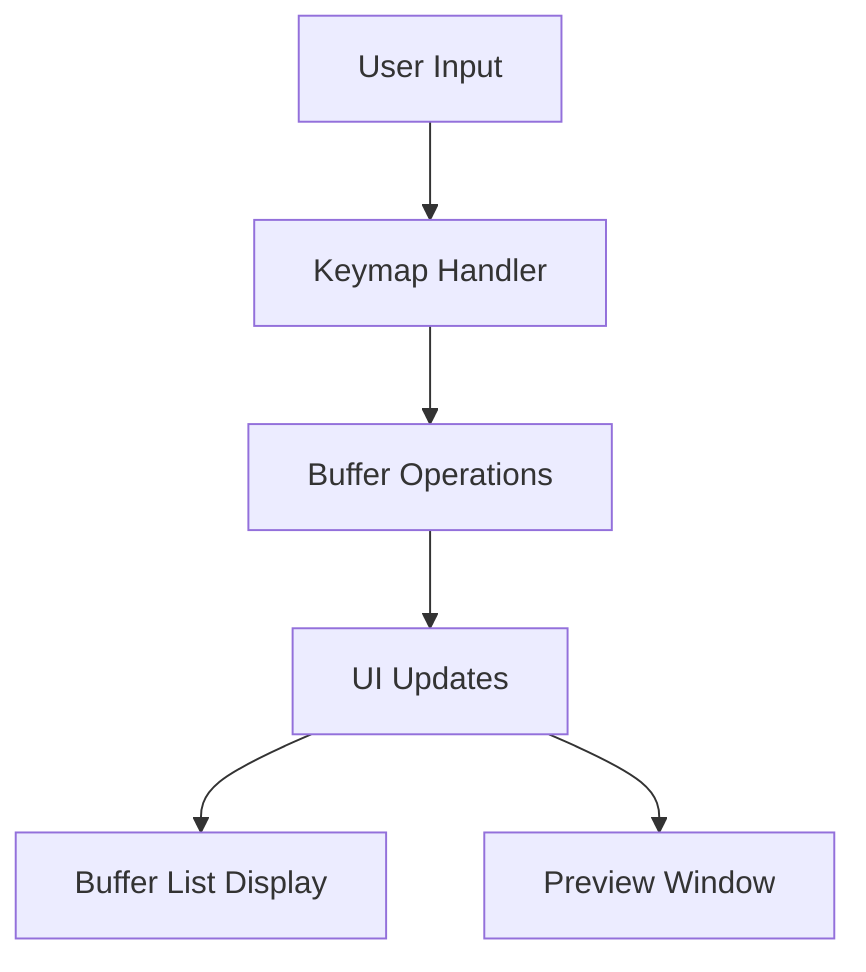

# nvim-bufflow Overview

## Core Concepts

nvim-bufflow is a Neovim plugin for efficient buffer management with preview capabilities.

## Architecture

The plugin is structured into the following main components:

### Buffer Management (`buffer.lua`)
- Handles core buffer operations
- Provides functions for:
  - Listing all buffers
  - Opening buffers
  - Closing/deleting buffers
  - Bulk buffer operations
  - Buffer state management

### UI Layer (`ui.lua`)
- Manages the visual presentation
- Components:
  - Buffer list window
  - Preview window
  - Status indicators
  - Selection highlighting

### Keymapping (`keymap.lua`)
- Defines user interactions
- Default mappings for:
  - Navigation (j/k)
  - Buffer selection (Enter)
  - Buffer deletion (d)
  - Bulk operations
  - Preview toggling

## Data Flow



## Testing Strategy

Using mini.test framework:
1. Buffer operations testing
   - Buffer listing
   - Open/close operations
   - Delete operations
   - Bulk operations

2. UI testing
   - Window creation/destruction
   - Content rendering
   - Preview functionality

3. Keymap testing
   - Input handling
   - Command execution
   - Event propagation

## File Structure

```
lua/bufflow/
├── init.lua      # Plugin entry point and setup
├── buffer.lua    # Buffer management logic
├── ui.lua        # UI components and rendering
└── keymap.lua    # Keybinding definitions
```

## Implementation Plan

1. Core Buffer Management
   - Implement basic buffer operations
   - Add bulk operation support
   - Handle buffer state management

2. UI Components
   - Create buffer list window
   - Implement preview window
   - Add status indicators
   - Handle window layout

3. User Interface
   - Define default keymaps
   - Add customization options
   - Implement event handlers
